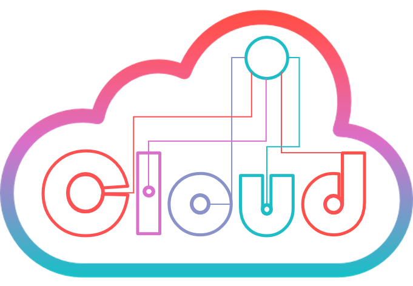

<!--
*** Thanks for checking out the Best-README-Template. If you have a suggestion
*** that would make this better, please fork the repo and create a pull request
*** or simply open an issue with the tag "enhancement".
*** Thanks again! Now go create something AMAZING! :D
-->


<!-- PROJECT SHIELDS -->
<!--
*** I'm using markdown "reference style" links for readability.
*** Reference links are enclosed in brackets [ ] instead of parentheses ( ).
*** See the bottom of this document for the declaration of the reference variables
*** for contributors-url, forks-url, etc. This is an optional, concise syntax you may use.
*** https://www.markdownguide.org/basic-syntax/#reference-style-links
-->
[![Contributors][contributors-shield]][contributors-url]
[![Forks][forks-shield]][forks-url]
[![Issues][issues-shield]][issues-url]
[![License][license-shield]][license-url]
[![LinkedIn][linkedin-shield]][linkedin-url]


<!-- PROJECT LOGO -->
<br />
<p align="center">
  <a href="https://github.com/JoseAAManzano/CLOUD">
    
  </a>

  <h3 align="center">Constrained Learner of Orthography: Unified, Distributed, and Dynamic</h3>

  <p align="center">
    <a href="https://psyarxiv.com/8tx7p/"><strong>PsyArXiv Preprint »</strong></a>
  </p>
</p>


<!-- TABLE OF CONTENTS -->
<details open="open">
  <summary>Table of Contents</summary>
  <ol>
    <li>
      <a href="#about-the-project">About The Project</a>
      <ul>
        <li><a href="#built-with">Built With</a></li>
      </ul>
    </li>
    <li>
      <a href="#getting-started">Getting Started</a>
      <ul>
        <li><a href="#prerequisites">Prerequisites</a></li>
      </ul>
    </li>
    <li><a href="#contributing">Contributing</a></li>
    <li><a href="#license">License</a></li>
    <li><a href="#contact">Contact</a></li>
	<li><a href="#cite-this-project">Cite this project</a></li>
    <li><a href="#acknowledgements">Acknowledgements</a></li>
  </ol>
</details>


<!-- ABOUT THE PROJECT -->
## About The Project

[![Product Name Screen Shot][product-screenshot]](https://github.com/JoseAAManzano/CLOUD)

The CLOUD model is a character-level LSTM network that processes words in one or more languages.

The model can:
* Learn distributed representations of multilingual input
* Store these representations in a unified space
* Perform an adapted version of the well-known Lexical Decision Task
* Learn new words by adjusting its representations dynamically
* Reproduce behavioral effects in foreign vocabulary learning as reported in Aguasvivas et al. (PsyArXiv 2021)

### Built With

* [Pytorch](https://pytorch.org/)


<!-- GETTING STARTED -->
## Getting Started

To implement our architecture, simply download the `cloudmodel.py` file and instantiate a CLOUD model in python:

```from cloudmodel import CLOUD
model = CLOUD(char_vocab_size,
			n_embedding,
			n_hidden,
			n_layers,
			drop_p,
			pad_idx)
```

However, to pass words to the model, train, and test with different languages, we recommend also using our `utils.py` functions and classes.

### Prerequisites

The prerequisites can be found in the `requirements.txt` file. To install in a new environment, please use the following PIP command:

```pip install -r /path/to/requirements.txt```


<!-- CONTRIBUTING -->
## Contributing

Contributions are what make the open source community such an amazing place to be learn, inspire, and create. Any contributions you make are **greatly appreciated**.

1. Fork the Project
2. Create your Feature Branch (`git checkout -b feature/AmazingFeature`)
3. Commit your Changes (`git commit -m 'Add some AmazingFeature'`)
4. Push to the Branch (`git push origin feature/AmazingFeature`)
5. Open a Pull Request


<!-- LICENSE -->
## License

Distributed under the Apache 2.0 License. See `LICENSE` for more information.


<!-- CONTACT -->
## Contact

Jose Aguasvivas - joseaamanzano@gmail.com

Project Link: [CLOUD](https://github.com/JoseAAManzano/CLOUD/)

<!-- CITATION -->
## Cite this project

Our paper is currently under review. We will update the citations accordingly once it is accepted for publication. However, if you decide to cite this work before it is published, please use the following:

**APA**

Aguasvivas, J. A., Testolin, A., Zorzi, M., & Carreiras, M. (2021, August 3). Words in the CLOUD: How orthographic similarity and bilingual experience facilitate foreign vocabulary learning. https://doi.org/10.31234/osf.io/8tx7p

**MLA**

Aguasvivas, Jose A., et al. “Words in the CLOUD: How Orthographic Similarity and Bilingual Experience Facilitate Foreign Vocabulary Learning.” PsyArXiv, 3 Aug. 2021. Web.

**Chicago**

Aguasvivas, Jose A., Alberto Testolin, Marco Zorzi, and Manuel Carreiras. 2021. “Words in the CLOUD: How Orthographic Similarity and Bilingual Experience Facilitate Foreign Vocabulary Learning.” PsyArXiv. August 3. doi:10.31234/osf.io/8tx7p.

<!-- ACKNOWLEDGEMENTS -->
## Acknowledgements
* [Best README-Template](https://github.com/othneildrew/Best-README-Template)
* [Img Shields](https://shields.io)
* [Choose an Open Source License](https://choosealicense.com)
* [EMBO Short-Term Fellowship](https://www.embo.org/funding/)
* [Logo based on design by iconixar from flaticon.com](https://www.flaticon.com/)


<!-- MARKDOWN LINKS & IMAGES -->
<!-- https://www.markdownguide.org/basic-syntax/#reference-style-links -->
[contributors-shield]: https://img.shields.io/github/contributors/othneildrew/Best-README-Template.svg?style=for-the-badge
[contributors-url]: https://github.com/JoseAAManzano/CLOUD/graphs/contributors
[forks-shield]: https://img.shields.io/github/forks/othneildrew/Best-README-Template.svg?style=for-the-badge
[forks-url]: https://github.com/JoseAAManzano/CLOUDnetwork/members
[issues-shield]: https://img.shields.io/github/issues/JoseAAManzano/CLOUD
[issues-url]: https://github.com/JoseAAManzano/CLOUD/issues
[license-shield]: https://img.shields.io/badge/License-Apache%202.0-blue.svg
[license-url]: https://github.com/othneildrew/Best-README-Template/blob/master/LICENSE.txt
[linkedin-shield]: https://img.shields.io/badge/-LinkedIn-black.svg?style=for-the-badge&logo=linkedin&colorB=555
[linkedin-url]: https://linkedin.com/in/joseaamanzano
[product-screenshot]: images/Fig1.png
